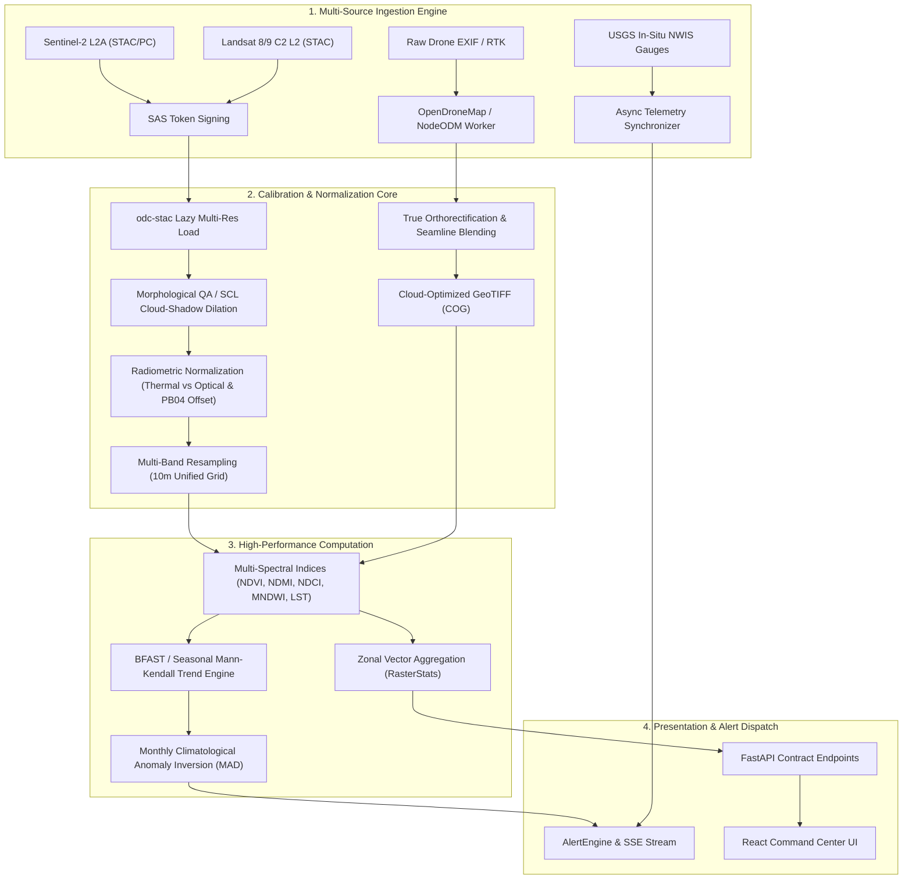

# Domain Research: Scientific and Technical Foundations of GIOS

**Author:** Agent 1 — Domain Researcher (@domain-researcher)  
**Target Milestone:** Foundation Specification for GIOS Engine  
**Date:** September 2026  
**Status:** Completed — Ready for Agent 4 (Master) & Agent 3 (Implementation Planner)  
**Output Target:** `production_artifacts/Domain_Research.md`

---

## Executive Summary

The Global Intelligence & Observation System (GIOS) aims to bridge high-resolution drone photogrammetry, satellite Earth Observation (EO) streams (Sentinel-2, Landsat 8/9), and in-situ hydrometeorological sensor networks into a unified hazard monitoring and geospatial intelligence engine.

This domain research report establishes the rigorous mathematical, physical, and computational foundations required for GIOS. It reviews established remote sensing practices, investigates orthomosaic generation pipelines, multi-spectral sensor processing hierarchies, radiometric and atmospheric correction models, and spatiotemporal anomaly detection. 

Critically, this investigation includes a line-by-line scientific audit of the current GIOS codebase (`app/`). The audit reveals multiple foundational errors—including catastrophic thermal band radiometric scaling corruption, omission of Sentinel-2 Processing Baseline 04.00+ reflectance offsets, scientifically invalid single-date burn severity classification, unhandled multi-resolution band arrays, absence of cloud-mask morphological dilation, and hardcoded simulated endpoints where core remote sensing routines are bypassed. Comprehensive mathematical corrections and architectural remediations are provided, supported by peer-reviewed academic literature.

---

## Table of Contents
1. [Photogrammetry & Orthomosaic Generation Architecture](#1-photogrammetry--orthomosaic-generation-architecture)
   - 1.1 Structure-from-Motion (SfM) Workflow
   - 1.2 Multi-View Stereo (MVS) & Dense Point Cloud Reconstruction
   - 1.3 Digital Elevation Models (DSM vs. DTM)
   - 1.4 True Orthorectification vs. Traditional Orthorectification
   - 1.5 Radiometric Blending & Seamline Optimization
   - 1.6 Open-Source & Production Photogrammetry Engines
2. [Satellite Earth Observation Processing: Sentinel-2 & Landsat 8/9](#2-satellite-earth-observation-processing-sentinel-2--landsat-89)
   - 2.1 Sensor Specifications & Spatial/Spectral Characteristics
   - 2.2 Data Product Processing Tiers (Level-1 to Level-3)
   - 2.3 Sentinel-2 Processing Baseline 04.00+ Offset Shift
   - 2.4 Harmonized Landsat Sentinel-2 (HLS) Principles
3. [Radiometric, Atmospheric, and Geometric Correction](#3-radiometric-atmospheric-and-geometric-correction)
   - 3.1 Radiometric Calibration & Scaling Mathematics
   - 3.2 Atmospheric Radiative Transfer & Operational Processors
   - 3.3 Topographic & Illumination Correction
   - 3.4 Geometric Co-Registration & Resampling Kernels
4. [Spectral Indices & Biophysical Parameter Derivation](#4-spectral-indices--biophysical-parameter-derivation)
   - 4.1 Vegetation Indices (NDVI, EVI, SAVI)
   - 4.2 Hydrological & Moisture Indices (NDWI, MNDWI, NDMI)
   - 4.3 Aquatic Quality & Harmful Algal Bloom Detection (NDCI)
   - 4.4 Fire Ecology & Burn Severity (NBR vs. dNBR / RdNBR)
   - 4.5 Land Surface Temperature (LST) Physics
5. [Spatiotemporal Statistics & Anomaly Detection](#5-spatiotemporal-statistics--anomaly-detection)
   - 5.1 Phenological Seasonality vs. Environmental Trends
   - 5.2 Non-Parametric Trend Detection (Mann-Kendall & Theil-Sen)
   - 5.3 Dynamic Climatological Baselines vs. Static Z-Scores
6. [Comprehensive Scientific Audit of the Current GIOS Codebase (`app/`)](#6-comprehensive-scientific-audit-of-the-current-gios-codebase-app)
   - 6.1 Critical Errors (Severity: High / Breaking)
   - 6.2 Architectural Gaps & Missing Methods (Severity: Medium)
   - 6.3 Code-Level Audit Matrix
   - 6.4 Concrete Remediation Specifications
7. [Target Remote Sensing Architecture for GIOS](#7-target-remote-sensing-architecture-for-gios)
8. [Bibliography & Academic Citations](#8-bibliography--academic-citations)

---

## 1. Photogrammetry & Orthomosaic Generation Architecture

An orthomosaic is a geometrically corrected, planimetrically accurate composite aerial image generated from overlapping perspective photographs. Unlike conventional unrectified aerial photographs, every pixel in a true orthomosaic exhibits uniform scale and orthogonal projection, permitting direct distance, area, and vector calculations within a geographic information system (GIS) (Kraus, 2007).

```
                      RAW UAV IMAGERY (with EXIF GPS/IMU)
                                      │
                                      ▼
                  Feature Detection & Description (SIFT)
                                      │
                                      ▼
                    Feature Matching & Epipolar Pruning
                                      │
                                      ▼
             Incremental / Global Bundle Adjustment (BA) ◄── Ground Control Points
                                      │                        (GCPs / RTK GNSS)
                                      ▼
                       Sparse Point Cloud (Tie Points)
                                      │
                                      ▼
                   Multi-View Stereo (MVS) Dense Matching
                                      │
                                      ▼
                             Dense Point Cloud
                                      │
                     ┌────────────────┴────────────────┐
                     ▼                                 ▼
             DSM Generation                    DTM Extraction
         (TIN / IDW on All Points)      (Progressive Morphological / CSF Filter)
                     │                                 │
                     └────────────────┬────────────────┘
                                      │
                                      ▼
                        Visibility & Occlusion Analysis
                           (Z-Buffering / Angle-Check)
                                      │
                                      ▼
                         Seamline Network Extraction
                          (Graph-Cut / Voronoi Energy)
                                      │
                                      ▼
                   True Orthorectification & Radiometric Blending
                        (Multiband / Poisson Feathering)
                                      │
                                      ▼
                        Cloud-Optimized GeoTIFF (COG)
```

### 1.1 Structure-from-Motion (SfM) Workflow

The photogrammetric reconstruction begins with Structure-from-Motion (SfM), an algorithm adapted from computer vision that simultaneously solves for 3D scene geometry and camera motion parameters from unordered overlapping images (Snavely et al., 2006; Westoby et al., 2012).

1. **Feature Extraction and Invariant Descriptors**:
   Scale-Invariant Feature Transform (SIFT) detects scale-space extrema in a Difference-of-Gaussian (DoG) pyramid:
   $$D(x, y, \sigma) = (G(x, y, k\sigma) - G(x, y, \sigma)) * I(x, y)$$
   where $G(x, y, \sigma)$ is a variable-scale Gaussian kernel and $I(x, y)$ is the input image (Lowe, 2004). Keypoints with low contrast or localized along edges are discarded. Keypoints are assigned canonical orientations based on local image gradient directions and encoded into 128-dimensional orientation histograms, rendering them invariant to image translation, scaling, and rotation, and partially invariant to affine distortion and illumination changes.

2. **Feature Matching & Robust Epipolar Estimation**:
   Descriptors between overlapping image pairs are matched using approximate nearest-neighbor search (e.g., k-d trees). Ambiguous matches are filtered using Lowe's ratio test (second-nearest-neighbor distance ratio $d_1 / d_2 < 0.75$). Putative matches are verified geometrically via the Random Sample Consensus (RANSAC) algorithm to compute the Essential Matrix $E$ (or Fundamental Matrix $F$):
   $$x'^T F x = 0$$
   Outliers violating epipolar geometry are discarded (Hartley & Zisserman, 2004).

3. **Bundle Adjustment (BA)**:
   The core optimization step solves a non-linear least-squares problem to refine 3D point coordinates $X_j$, camera exterior orientation parameters (rotations $R_i$, translations $T_i$), and camera interior orientation parameters (focal length $f$, principal point $(c_x, c_y)$, radial distortion $k_1, k_2, k_3$, and tangential distortion $p_1, p_2$) (Triggs et al., 1999). Bundle adjustment minimizes the total reprojection error between observed feature points $x_{ij}$ and predicted projections $\hat{x}(R_i, T_i, K_i, X_j)$:
   $$\min_{R_i, T_i, K_i, X_j} \sum_{i=1}^{M} \sum_{j=1}^{N} v_{ij} \, d\left(x_{ij}, \, \mathcal{P}(K_i, R_i, T_i, X_j)\right)^2$$
   where $v_{ij} = 1$ if point $j$ is visible in image $i$ and 0 otherwise, and $\mathcal{P}$ represents the collinearity equations. Optimization is achieved through the Levenberg-Marquardt (LM) algorithm using sparse matrix factorization (e.g., Ceres Solver).

4. **Absolute Georeferencing & Ground Control Points (GCPs)**:
   Pure SfM reconstructions suffer from gauge ambiguity (scale, translation, and rotational ambiguity). Absolute georeferencing is achieved by:
   - Incorporating high-precision Ground Control Points (GCPs) surveyed via RTK/PPK GNSS (Root Mean Square Error $\text{RMSE} < 2\text{ cm}$).
   - Direct georeferencing using RTK/PPK UAV camera centers with antenna-to-camera lever-arm offsets and GNSS time synchronization.
   - Transforming from local arbitrary Cartesian space to a projected coordinate reference system (e.g., WGS 84 / UTM Zone 10N, EPSG:32610) via a 7-parameter similarity transformation (Helmert transformation).

### 1.2 Multi-View Stereo (MVS) & Dense Point Cloud Reconstruction

While SfM generates a sparse point cloud (thousands of tie points), Multi-View Stereo (MVS) reconstructs dense 3D surfaces (millions to billions of points) by computing per-pixel depth and normal estimates (Furukawa & Ponce, 2010).

- **Semi-Global Matching (SGM) / PatchMatch MVS**: Evaluates photo-consistency across epipolar lines using Normalized Cross-Correlation (NCC) or Census transform cost functions. SGM approximates a 2D Markov Random Field energy minimization by penalizing small and large depth disparities along multiple 1D paths across the image (Hirschmüller, 2008).
- **Point Fusion and Outlier Filtering**: Depth maps from multiple overlapping camera views are merged into a unified coordinate system. Points with low visual consistency, high reprojection uncertainty, or insufficient multi-ray triangulation angles ($< 2^\circ$) are filtered.

### 1.3 Digital Elevation Models (DSM vs. DTM)

- **Digital Surface Model (DSM)**: Represents the elevations of the uppermost reflective surfaces, capturing tree canopies, buildings, infrastructure, and bare ground. It is generated by constructing a Triangulated Irregular Network (TIN) or applying Inverse Distance Weighting (IDW) interpolation directly onto the dense point cloud.
- **Digital Terrain Model (DTM)**: Represents the bare ground elevation without above-ground features (vegetation, structures). To generate a DTM from UAV photogrammetry:
  1. Points must be classified into ground and non-ground using algorithms such as Progressive TIN Densification (Axelsson, 2000) or Cloth Simulation Filtering (CSF) (Zhang et al., 2016).
  2. Non-ground points are removed, and ground voids are interpolated using Ordinary Kriging or Natural Neighbor interpolation.

### 1.4 True Orthorectification vs. Traditional Orthorectification

Traditional orthorectification projects perspective imagery onto a coarse DTM. Because tall structures (dams, buildings, trees) are not represented in the DTM, perspective displacement causes:
- "Building lean" or structure radial displacement away from the nadir point.
- Smearing or double-mapping of occluded areas along steep vertical faces.

**True Orthorectification** overcomes this by utilizing the high-resolution DSM (Schickler & Thorpe, 1998; Zhou, 2009):
1. **Ray-Tracing Projection**: Every DSM raster cell $(X, Y, Z)$ is back-projected into all potential candidate images using calibrated interior and exterior camera matrices.
2. **Occlusion Detection**: An occlusion map is generated via Z-buffering or angle-based line-of-sight analysis. If a terrain feature or structure blocks the ray path between the DSM point and the camera projection center, that cell is flagged as occluded for that specific view.
3. **Nadir Priority Selection**: From all unoccluded candidate images, the pixel with the smallest incidence angle (closest to nadir) is selected to maximize spatial resolution and minimize ground shadowing effects.

### 1.5 Radiometric Blending & Seamline Optimization

When assembling hundreds of individual orthophotos into a seamless mosaic, visual seamlines and brightness steps occur due to varying sun angles, cloud shadows, automatic camera exposure changes, and anisotropic bidirectional reflectance (BRDF).

1. **Seamline Optimization**:
   - Instead of straight geometric tile boundaries, seamlines are routed through areas where the radiometric difference between adjacent overlapping images is minimized.
   - Algorithms formulate seamline extraction as a graph-cut minimum energy problem or Dijkstra shortest path problem:
     $$E(L) = \sum_{p \in L} \left( \|\nabla I_1(p) - \nabla I_2(p)\| + \alpha \|I_1(p) - I_2(p)\| + \beta \cdot \text{ObstacleCost}(p) \right)$$
     where $\text{ObstacleCost}$ heavily penalizes crossing elevated structures (buildings, dams, trees) or water bodies, forcing seamlines through flat bare ground (Chon et al., 2010).
2. **Multiband (Pyramid) Spline Blending**:
   - High spatial frequency details (edges, textures) are blended across narrow transition widths to prevent blurring.
   - Low spatial frequency variations (illumination gradients, color cast) are blended across wide transition zones to eliminate visible boundaries (Burt & Adelson, 1983).
   - Alternatively, Poisson Image Editing solves Poisson's equation with Dirichlet boundary conditions to match gradients across images (Pérez et al., 2003).

### 1.6 Open-Source & Production Photogrammetry Engines

| Engine / Library | Architecture | License | Capabilities & Role in GIOS |
| :--- | :--- | :--- | :--- |
| **OpenDroneMap (ODM)** | Python / C++ (NodeODM API) | AGPL-3.0 | Complete headless pipeline: SfM (OpenSfM), MVS (OpenMVS), DTM filtering (CSF), True Ortho, COG tiling. Prime candidate for GIOS worker execution. |
| **OpenSfM** | Python / C++ / Ceres Solver | BSD-2-Clause | Standalone SfM library developed by Mapillary. Highly scalable, handles spherical and perspective camera models. |
| **COLMAP** | C++ / CUDA | BSD-3-Clause | Gold-standard academic SfM/MVS engine with rigorous mathematical optimization and pixel-wise view selection. |
| **MicMac** | C++ (IGN France) | CeCILL-B | Rigorous geodetic photogrammetric suite capable of handling complex satellite, aerial, and terrestrial geometries. |
| **PDAL** | C++ / Python Bindings | BSD | Point Data Abstraction Library; filtering, classification (CSF), ground extraction, and point cloud rasterization. |

---

## 2. Satellite Earth Observation Processing: Sentinel-2 & Landsat 8/9

### 2.1 Sensor Specifications & Spatial/Spectral Characteristics

Modern satellite remote sensing for environmental and geotechnical hazard intelligence relies primarily on the European Space Agency (ESA) Copernicus Sentinel-2 constellation (Sentinel-2A and 2B) and the USGS/NASA Landsat program (Landsat 8 and 9).

| Mission / Sensor | Band Identifier | Central Wavelength ($\mu\text{m}$) | Bandwidth ($\text{nm}$) | Spatial Resolution ($\text{m}$) | Radiometric Quantization |
| :--- | :--- | :--- | :--- | :--- | :--- |
| **Sentinel-2 MSI** | B01 (Coastal Aerosol) | 0.443 | 20 | 60 | 12-bit (scaled 16-bit) |
| | B02 (Blue) | 0.490 | 65 | 10 | 12-bit |
| | B03 (Green) | 0.560 | 35 | 10 | 12-bit |
| | B04 (Red) | 0.665 | 30 | 10 | 12-bit |
| | B05 (Vegetation Red Edge 1) | 0.705 | 15 | 20 | 12-bit |
| | B06 (Vegetation Red Edge 2) | 0.740 | 15 | 20 | 12-bit |
| | B07 (Vegetation Red Edge 3) | 0.783 | 20 | 20 | 12-bit |
| | B08 (NIR Broad) | 0.842 | 115 | 10 | 12-bit |
| | B8A (NIR Narrow) | 0.865 | 20 | 20 | 12-bit |
| | B09 (Water Vapour) | 0.945 | 20 | 60 | 12-bit |
| | B10 (SWIR - Cirrus) | 1.375 | 30 | 60 (L1C only) | 12-bit |
| | B11 (SWIR 1) | 1.610 | 90 | 20 | 12-bit |
| | B12 (SWIR 2) | 2.190 | 180 | 20 | 12-bit |
| **Landsat 8/9 OLI/TIRS** | B1 (Coastal Aerosol) | 0.443 | 16 | 30 | 14-bit (scaled 16-bit) |
| | B2 (Blue) | 0.482 | 60 | 30 | 14-bit |
| | B3 (Green) | 0.561 | 57 | 30 | 14-bit |
| | B4 (Red) | 0.655 | 37 | 30 | 14-bit |
| | B5 (NIR) | 0.865 | 28 | 30 | 14-bit |
| | B6 (SWIR 1) | 1.609 | 85 | 30 | 14-bit |
| | B7 (SWIR 2) | 2.201 | 187 | 30 | 14-bit |
| | B8 (Panchromatic) | 0.590 | 172 | 15 | 14-bit |
| | B9 (Cirrus) | 1.373 | 38 | 30 | 14-bit |
| | B10 (TIRS 1 - Thermal) | 10.895 | 590 | 100 (resampled 30) | 12-bit (scaled 16-bit) |
| | B11 (TIRS 2 - Thermal) | 12.005 | 1010 | 100 (resampled 30) | 12-bit (scaled 16-bit) |

*Key Takeaway for GIOS:* Sentinel-2 bands span three distinct spatial resolutions (10 m, 20 m, and 60 m). Computing multi-spectral indices (such as NDCI or MNDWI) requires explicit resampling to a common spatial grid (e.g., 10 m or 20 m) to prevent dimension mismatch and pixel alignment artifacts.

### 2.2 Data Product Processing Tiers (Level-1 to Level-3)

1. **Landsat Collection 2 Tier Structure (USGS, 2021)**:
   - **Level-1**: Top-of-Atmosphere (TOA) calibrated data.
     * *L1TP (Tier 1 Precision & Terrain)*: Geodetically calibrated with Ground Control Points and DEM; geometric RMSE $< 12\text{ m}$. Suitable for pixel-level time series.
     * *L1GT (Tier 2 Systematic)*: Systematic geometric correction based on spacecraft ephemeris; lacks sufficient GCPs.
     * *L1GS*: Coarse geometric correction.
     * *Real-Time (RT)*: Rapidly downlinked data before definitive auxiliary ephemeris and clock data are available.
   - **Level-2**: Surface Reflectance (SR) and Land Surface Temperature (ST) science products. Generated via LaSRC (Land Surface Reflectance Code) for OLI and single-channel radiative transfer for TIRS.
   - **Level-3**: High-level science products, such as Dynamic Surface Water Extent (DSWE), Fractional Snow Covered Area (fSCA), and Burn Severity.

2. **Sentinel-2 Processing Levels (ESA, 2021)**:
   - **Level-1C (L1C)**: Top-Of-Atmosphere (TOA) reflectance in fixed $100\times 100\text{ km}^2$ tiles orthorectified in UTM/WGS84 projection. Includes radiometric offset and solar angle geometry grids.
   - **Level-2A (L2A)**: Bottom-Of-Atmosphere (BOA) surface reflectance derived via Sen2Cor or MAJA processors. Accompanied by a 20 m Scene Classification Layer (SCL), Aerosol Optical Thickness (AOT), and Water Vapour (WV) maps.

### 2.3 Sentinel-2 Processing Baseline 04.00+ Offset Shift

On **January 25, 2022**, ESA deployed **Processing Baseline 04.00 (PB 04.00)** across the Sentinel-2 ground segment (ESA, 2021).
- **Physical Reason**: Under earlier baselines, negative surface reflectance values (which frequently occur naturally over dark targets, water, or shadowed terrain due to atmospheric over-correction) were clipped to 0. This caused positive radiometric bias and corrupted atmospheric time-series statistics.
- **Implementation**: ESA introduced a constant radiometric additive offset of $+1000$ Digital Numbers (DN) to all L2A surface reflectance bands:
  $$\text{DN}_{\text{stored}} = \rho_{\text{BOA}} \times 10000 + 1000$$
  Consequently, to extract physical surface reflectance $\rho_{\text{BOA}} \in [0, 1]$ from PB 04.00+ data, the formula is:
  $$\rho_{\text{BOA}} = \frac{\text{DN} - 1000}{10000} = \frac{\text{DN} + \text{BOA\_ADD\_OFFSET}}{10000} \quad (\text{where } \text{BOA\_ADD\_OFFSET} = -1000)$$
- **Impact on Unaware Codebases**: If an algorithm blindly computes $\rho = \text{DN} \times 0.0001$ without checking the metadata `BOA_ADD_OFFSET`, every surface reflectance value is inflated by $+0.1000$ (+10% absolute reflectance). Over water bodies where true red reflectance is $\sim 0.02$, the computed reflectance becomes $0.12$—a $500\%$ relative error that completely corrupts indices like NDWI, MNDWI, and NDVI.

### 2.4 Harmonized Landsat Sentinel-2 (HLS) Principles

Developed by NASA and USGS, the Harmonized Landsat Sentinel-2 (HLS) project provides consistent surface reflectance records by eliminating cross-sensor disparities (Claverie et al., 2018):
1. **Geometric Alignment**: Landsat data are resampled onto the Sentinel-2 Military Grid Reference System (MGRS) $100\times 100\text{ km}^2$ UTM tiles at 30 m resolution.
2. **Nadir BRDF-Adjusted Reflectance (NBAR)**: Bidirectional Reflectance Distribution Function (BRDF) effects caused by differing solar zenith angles and off-nadir view angles are normalized to a constant nadir view ($\theta_v = 0^\circ$) and local solar noon illumination using the RossThick-LiSparse-R model.
3. **Spectral Bandpass Adjustment**: Because Sentinel-2 MSI and Landsat OLI relative spectral response (RSR) filters differ slightly, linear regression coefficients are applied to translate Landsat OLI bands into equivalent Sentinel-2 spectral bands:
   $$\rho_{\text{equivalent}} = c_0 + c_1 \rho_{\text{source}}$$

---

## 3. Radiometric, Atmospheric, and Geometric Correction

### 3.1 Radiometric Calibration & Scaling Mathematics

Satellite detectors measure continuous electromagnetic energy converted to discrete Digital Numbers (DN). Transforming DN into physical quantities requires rigorous adherence to provider-specific calibration equations.

#### Landsat Collection 2 Level-2 Calibration (USGS, 2021)
Landsat Collection 2 Level-2 products store data as unsigned 16-bit integers (`uint16`). Optical surface reflectance (SR) and thermal surface temperature (ST) require distinct linear transformations:

1. **Optical Bands (Bands 1–7)**:
   $$\rho_{\lambda} = \text{DN} \times 0.0000275 - 0.2$$
   Valid valid reflectance range is $[0.0, 1.0]$. The DN value 0 represents fill data.

2. **Thermal Surface Temperature (Band 10)**:
   $$T_K = \text{DN} \times 0.00341802 + 149.0 \quad (\text{Kelvin})$$
   $$T_C = T_K - 273.15 = \text{DN} \times 0.00341802 - 124.15 \quad (^\circ\text{Celsius})$$

```
CRITICAL SCIENTIFIC DISTINCTION:
Applying the optical formula (DN * 0.0000275 - 0.2) to thermal Band 10 results in 
catastrophic failure. A valid thermal DN of 40,000 (corresponding to 285.7 K / 12.5 °C) 
would yield 0.90, which when converted to Celsius represents impossible physical values.
```

### 3.2 Atmospheric Radiative Transfer & Operational Processors

Electromagnetic radiation traveling from the Earth's surface to a spaceborne sensor is attenuated by atmospheric scattering and absorption, while path radiance is added:
$$L_{\text{sensor}}(\lambda) = L_{\text{surface}}(\lambda) \cdot \tau(\lambda) + L_{\text{path}}(\lambda) + L_{\text{adjacency}}(\lambda)$$
where $\tau(\lambda)$ is atmospheric transmittance, $L_{\text{path}}$ is Rayleigh and aerosol scattering, and $L_{\text{adjacency}}$ is scattered radiation from neighboring pixels (Vermote et al., 1997).

```
          Direct Solar Flux
                 │
                 ▼
          ┌─────────────┐
          │ Atmosphere  │ ◄── Rayleigh Scattering (λ⁻⁴) & Aerosol (Mie) Scattering
          └──────┬──────┘ ◄── Path Radiance (L_path) reflected directly to sensor
                 │
      ┌──────────┴──────────┐
      ▼                     ▼
Direct Solar           Diffuse Skylight
Irradiance               Irradiance
      │                     │
      └──────────┬──────────┘
                 ▼
         Target Surface Reflectance (ρ) ──► Sensor (via Transmittance τ)
```

1. **Physical Radiative Transfer Codes**:
   - **6S (Second Simulation of a Satellite Signal in the Solar Spectrum)**: Vector formulation modeling molecular (Rayleigh) scattering, aerosol scattering (Mie theory), and gas absorption ($\text{H}_2\text{O}, \text{O}_3, \text{CO}_2, \text{CH}_4$) across arbitrary view/illumination geometries (Vermote et al., 1997).
   - **MODTRAN (Moderate Resolution Atmospheric Transmission)**: High-resolution spectral modeling used primarily for hyperspectral calibration.

2. **Operational Satellite Atmospheric Processors**:
   - **Sen2Cor (ESA)**: Operational L2A processor for Sentinel-2. Computes Aerosol Optical Thickness (AOT) at 550 nm using the Dense Dark Vegetation (DDV) algorithm (Kaufman & Sendra, 1988) by correlating 2.19 $\mu\text{m}$ (B12) with visible bands B02 and B04. Computes Water Vapour (WV) using the Atmospheric Pre-corrected Differential Absorption (APDA) algorithm across B09 (945 nm) and B8A (865 nm) (Louis et al., 2016).
   - **LaSRC (Land Surface Reflectance Code - USGS/NASA)**: Operational Level-2 processor for Landsat 8/9 and Sentinel-2. Employs the 6S radiative transfer code paired with MODIS/VIIRS ancillary atmospheric data and ratio-based inversion (Vermote et al., 2016).
   - **MAJA (MACCS-ATCOR Joint Algorithm - CNES/CESBIO)**: Multi-temporal processor. Rather than relying on single-date dark targets, MAJA exploits the fact that surface reflectance changes slowly over time while atmospheric aerosols and clouds change rapidly. It achieves superior cloud shadow detection and AOT retrieval (Hagolle et al., 2015; Baetens et al., 2019).
   - **Aquatic Processors (ACOLITE / Polymer)**: Terrestrial atmospheric models fail over water bodies because water-leaving radiance is near zero in the SWIR. ACOLITE uses the Dark Spectrum Fitting (DSF) or exponential SWIR ratios to decouple aerosol reflectance from water reflectance (Vanhellemont & Ruddick, 2018).

### 3.3 Topographic & Illumination Correction

In complex terrain (e.g., dam abutments, mountain watersheds), solar illumination varies dramatically with slope and aspect. The local solar incidence angle $\theta_i$ is defined as:
$$\cos \theta_i = \cos \theta_s \cos \theta_n + \sin \theta_s \sin \theta_n \cos(\phi_s - \phi_n)$$
where $\theta_s$ is solar zenith angle, $\phi_s$ is solar azimuth, $\theta_n$ is terrain slope, and $\phi_n$ is terrain aspect.

- **Cosine Correction**: Assumes a Lambertian surface:
  $$\rho_H = \rho_T \frac{\cos \theta_s}{\cos \theta_i}$$
  *Limitation*: Severely over-corrects dimly lit slopes ($\cos \theta_i \to 0$), producing saturation white noise.
- **C-Correction**: Non-Lambertian empirical adjustment adding parameter $c = b/m$ from linear regression $\rho_T = m \cos \theta_i + b$:
  $$\rho_H = \rho_T \frac{\cos \theta_s + c}{\cos \theta_i + c}$$
- **SCS+C (Sun-Canopy-Sensor + C)**: Preserves canopy sunlit geometry over sloped forested terrain (Soenen et al., 2005).

### 3.4 Geometric Co-Registration & Resampling Kernels

Multi-temporal change detection requires sub-pixel geometric alignment. Pixel shifts of just $0.5$ pixels between pre- and post-event scenes introduce up to $50\%$ false change artifacts along structural edges and land-cover boundaries (Townshend et al., 1992).
- **Automated Coregistration**: Fast Fourier Transform (FFT) phase correlation or localized cross-correlation (e.g., AROSICS; Scheffler et al., 2017) computes sub-pixel shift vectors across tie points.
- **Resampling Kernels**:
  * *Nearest Neighbor*: Preserves original radiometric DNs and categorical masks (e.g., SCL, QA_PIXEL). Must be used for discrete classification bands.
  * *Bilinear*: Linear interpolation across $2\times 2$ window. Smooths continuous reflectance.
  * *Cubic Convolution*: Approximates sinc function across $4\times 4$ window. Standard for continuous spectral imagery, balancing sharpness and edge integrity.
  * *Lanczos*: High-order sinc windowing; superior anti-aliasing when downsampling high-resolution imagery.

---

## 4. Spectral Indices & Biophysical Parameter Derivation

### 4.1 Vegetation Indices

1. **Normalized Difference Vegetation Index (NDVI)** (Rouse et al., 1974; Tucker, 1979):
   $$\text{NDVI} = \frac{\rho_{\text{NIR}} - \rho_{\text{Red}}}{\rho_{\text{NIR}} + \rho_{\text{Red}}}$$
   Measures chlorophyll absorption in Red and mesophyll scattering in NIR. Saturates at high leaf area index ($\text{LAI} > 3$).

2. **Enhanced Vegetation Index (EVI)** (Huete et al., 2002):
   $$\text{EVI} = G \times \frac{\rho_{\text{NIR}} - \rho_{\text{Red}}}{\rho_{\text{NIR}} + C_1 \rho_{\text{Red}} - C_2 \rho_{\text{Blue}} + L}$$
   Standard parameters: $G = 2.5$, $C_1 = 6.0$, $C_2 = 7.5$, $L = 1.0$. Minimizes atmospheric aerosol scattering via the blue band and mitigates canopy background soil reflectance.
   *EVI2 (Two-Band EVI)*: When blue band is contaminated by atmospheric noise or missing (Jiang et al., 2008):
   $$\text{EVI2} = 2.5 \times \frac{\rho_{\text{NIR}} - \rho_{\text{Red}}}{\rho_{\text{NIR}} + 2.4 \rho_{\text{Red}} + 1.0}$$

3. **Soil-Adjusted Vegetation Index (SAVI)** (Huete, 1988):
   $$\text{SAVI} = \frac{\rho_{\text{NIR}} - \rho_{\text{Red}}}{\rho_{\text{NIR}} + \rho_{\text{Red}} + L_{\text{soil}}} \times (1 + L_{\text{soil}}) \quad (L_{\text{soil}} = 0.5)$$

### 4.2 Hydrological & Moisture Indices

1. **Normalized Difference Water Index (NDWI)** (McFeeters, 1996):
   $$\text{NDWI} = \frac{\rho_{\text{Green}} - \rho_{\text{NIR}}}{\rho_{\text{Green}} + \rho_{\text{NIR}}}$$
   Designed to delineate open surface water bodies while eliminating soil and terrestrial vegetation.

2. **Modified Normalized Difference Water Index (MNDWI)** (Xu, 2006):
   $$\text{MNDWI} = \frac{\rho_{\text{Green}} - \rho_{\text{SWIR1}}}{\rho_{\text{Green}} + \rho_{\text{SWIR1}}}$$
   Replaces NIR with SWIR1 ($\sim 1.6\ \mu\text{m}$). Solves NDWI's fundamental weakness: built-up urban structures and soil reflect brightly in NIR, causing false water positives in NDWI. Built-up features absorb heavily in SWIR1, yielding sharp water delineation.

3. **Normalized Difference Moisture Index (NDMI / NDII)** (Gao, 1996):
   $$\text{NDMI} = \frac{\rho_{\text{NIR}} - \rho_{\text{SWIR1}}}{\rho_{\text{NIR}} + \rho_{\text{SWIR1}}}$$
   Measures liquid water content in vegetation canopies and surface soil moisture. Highly sensitive to geotechnical dam embankment seepage and drought stress.

### 4.3 Aquatic Quality & Harmful Algal Bloom Detection

**Normalized Difference Chlorophyll Index (NDCI)** (Mishra & Mishra, 2012):
$$\text{NDCI} = \frac{\rho_{\text{RedEdge1}} - \rho_{\text{Red}}}{\rho_{\text{RedEdge1}} + \rho_{\text{Red}}}$$
Over turbid, productive estuarine and inland waters, conventional NDVI fails due to suspended sediment backscattering. NDCI exploits the strong absorption peak of chlorophyll-a at $\sim 665\text{ nm}$ (Red, Sentinel-2 B04) and the reflectance peak at $\sim 705\text{ nm}$ (Red-Edge 1, Sentinel-2 B05) to quantify cyanobacterial blooms and algal biomass without sensitivity to suspended sediments.

### 4.4 Fire Ecology & Burn Severity

1. **Normalized Burn Ratio (NBR)** (Key & Benson, 2006):
   $$\text{NBR} = \frac{\rho_{\text{NIR}} - \rho_{\text{SWIR2}}}{\rho_{\text{NIR}} + \rho_{\text{SWIR2}}}$$
   Healthy vegetation displays high NIR reflection and low SWIR2 absorption. Burned areas display low NIR reflection and high SWIR2 reflection from charred earth and bare soil.

2. **Differenced Normalized Burn Ratio ($\Delta\text{NBR}$ / dNBR)**:
   $$\Delta\text{NBR} = \text{NBR}_{\text{pre-fire}} - \text{NBR}_{\text{post-fire}}$$
   $$\text{USGS FIREMON Severity Classification Matrix:}$$
   $$\begin{cases}
   \Delta\text{NBR} < -0.100 & \text{High Post-Fire Regrowth} \\
   -0.100 \le \Delta\text{NBR} < 0.100 & \text{Unburned / Low Change} \\
   0.100 \le \Delta\text{NBR} < 0.270 & \text{Low Severity} \\
   0.270 \le \Delta\text{NBR} < 0.440 & \text{Moderate-Low Severity} \\
   0.440 \le \Delta\text{NBR} < 0.660 & \text{Moderate-High Severity} \\
   \Delta\text{NBR} \ge 0.660 & \text{High Severity}
   \end{cases}$$

```
CRITICAL SCIENTIFIC ERROR IN GIOS CODEBASE:
The current GIOS codebase evaluates burn severity on single-date NBR values 
(e.g., NBR < -0.25). This violates USGS/USFS standards. A single post-fire scene 
cannot distinguish naturally arid, rock, or harvested agricultural land from a severe burn. 
Differencing against a validated pre-fire baseline is scientifically mandatory.
```

3. **Relativized Differenced NBR (RdNBR)** (Miller & Thode, 2007):
   $$\text{RdNBR} = \frac{\Delta\text{NBR}}{\sqrt{|\text{NBR}_{\text{pre-fire}}|}}$$
   Removes the pre-fire canopy density bias, ensuring sparse woodlands and dense forests are evaluated on an equitable scale.

### 4.5 Land Surface Temperature (LST) Physics

Deriving LST from Landsat TIRS requires solving the radiative transfer equation for thermal infrared radiance:
$$L_{\text{TOA}} = [\varepsilon \cdot B(T_s) + (1 - \varepsilon) L^{\downarrow}_{\text{atm}}] \cdot \tau + L^{\uparrow}_{\text{atm}}$$
where $B(T_s)$ is Planck's blackbody function at temperature $T_s$, $\varepsilon$ is surface emissivity, $\tau$ is atmospheric transmissivity, and $L^{\uparrow}_{\text{atm}}, L^{\downarrow}_{\text{atm}}$ are upwelling and downwelling thermal radiances (Sobrino et al., 2004; Cook et al., 2014). Inverting Planck's law:
$$T_s = \frac{K_2}{\ln\left(\frac{K_1}{L_{\text{surface}}} + 1\right)}$$
Surface emissivity $\varepsilon$ is parameterized from NDVI via the Fractional Vegetation Cover ($FVC$) method:
$$FVC = \left(\frac{\text{NDVI} - \text{NDVI}_{\text{soil}}}{\text{NDVI}_{\text{veg}} - \text{NDVI}_{\text{soil}}}\right)^2$$
$$\varepsilon = \varepsilon_{\text{veg}} \cdot FVC + \varepsilon_{\text{soil}} \cdot (1 - FVC) + d\varepsilon$$
Landsat Collection 2 Level-2 Surface Temperature products pre-calculate this integration using MODIS/ASTER GED emissivity and atmospheric profiles from the NASA Modern-Era Retrospective analysis for Research and Applications (MERRA-2).

---

## 5. Spatiotemporal Statistics & Anomaly Detection

### 5.1 Phenological Seasonality vs. Environmental Trends

A critical challenge in satellite time-series analysis is that optical indices fluctuate cyclically with seasonal phenology (spring green-up, autumn senescence). Fitting an ordinary least-squares (OLS) linear model across raw observations without seasonal decomposition creates severe mathematical errors:
- If observations are unevenly distributed (e.g., more clear summer images in early years and cloud-free winter images in later years), the linear slope will falsely report severe vegetation die-off.
- Standard decomposition separates the time series $Y_t$ into:
  $$Y_t = T_t + S_t + R_t$$
  where $T_t$ is long-term trend, $S_t$ is periodic seasonal component, and $R_t$ is the stochastic remainder / anomaly.
- **BFAST (Breaks For Additive Season and Trend)**: Decomposes satellite time series into trend, seasonal, and remainder components using iterative harmonic regression and identifies abrupt structural shifts (Verbesselt et al., 2010).

### 5.2 Non-Parametric Trend Detection (Mann-Kendall & Theil-Sen)

Satellite observations rarely follow a normal Gaussian distribution due to cloud masking gaps, sensor saturation, and sudden disturbances. Non-parametric statistical tests are mandatory:

1. **Mann-Kendall Test** (Mann, 1945; Kendall, 1975):
   Evaluates monotonic upward or downward trends without assuming normality:
   $$S = \sum_{k=1}^{n-1} \sum_{j=k+1}^n \text{sgn}(x_j - x_k)$$
   $$\text{sgn}(\theta) = \begin{cases} +1 & \theta > 0 \\ 0 & \theta = 0 \\ -1 & \theta < 0 \end{cases}$$
   Variance of $S$ is calculated accounting for tied ranks, yielding standardized test statistic $Z$.

2. **Theil-Sen Robust Slope Estimator** (Theil, 1950; Sen, 1968):
   Determines true median rate of change across all pairwise observation slopes:
   $$\beta = \text{median}\left(\frac{x_j - x_k}{j - k}\right) \quad \forall\ j > k$$
   Insensitive to up to $29\%$ gross outlier data points (such as undetected cloud shadows).

### 5.3 Dynamic Climatological Baselines vs. Static Z-Scores

The current GIOS codebase calculates anomalies using a static global z-score across all dates:
$$z = \frac{x_t - \mu_{\text{all}}}{\sigma_{\text{all}}}$$
*Why this fails:* In temperate climates, normal winter NDVI is $0.25$, while summer NDVI is $0.75$, with an overall annual mean of $0.50$ ($\sigma \approx 0.20$). Under a static z-score, every healthy winter is flagged as an anomaly ($z = -1.25$ to $-2.0$), while severe summer droughts ($NDVI = 0.45$) appear "normal" because they lie near the annual mean.

**Scientifically Valid Methodology**: Compute day-of-year (DOY) or monthly climatological baselines using robust statistics:
$$z_{\text{seasonal}}(t) = \frac{x_t - \text{Median}\left(X_{\text{month}(t)}\right)}{1.4826 \times \text{MAD}\left(X_{\text{month}(t)}\right)}$$
where $\text{MAD}$ is the Median Absolute Deviation. Any $|z_{\text{seasonal}}| > 2.5$ represents a true biophysical departure from expected seasonal norms.

---

## 6. Comprehensive Scientific Audit of the Current GIOS Codebase (`app/`)

### 6.1 Critical Errors (Severity: High / Breaking)

#### Bug 1: Landsat Thermal Band Radiometric Scaling Corruption
- **Location**: `app/services/preprocessing.py`, lines 30–36:
  ```python
  if "landsat" in collection.lower():
      for var in dataset.data_vars:
          if var != "qa_pixel":
              dataset[var] = dataset[var] * 0.0000275 - 0.2
  ```
- **Scientific Flaw**: The service iterates indiscriminately over all variables in the dataset and applies the optical surface reflectance formula ($DN \times 0.0000275 - 0.2$). In `app/services/data_acquisition.py` (line 21), Landsat's thermal band is registered as `"thermal": "lwir11"`. When the thermal band is loaded, its values ($\sim 35,000–45,000$) are multiplied by $0.0000275 - 0.2$, reducing them to $\sim 0.7–1.0$.
- **Downstream Consequence**: When `app/services/indices.py` (line 40) executes:
  ```python
  kelvin = thermal_dn * 0.00341802 + 149.0
  ```
  it multiplies $0.8 \times 0.00341802 + 149.0 \approx 149.002\text{ K} = -124.1^\circ\text{C}$. The calculated land surface temperature is corrupted by over $130^\circ\text{C}$.

#### Bug 2: Omission of Sentinel-2 Processing Baseline 04.00+ Radiometric Offset
- **Location**: `app/services/preprocessing.py`, lines 37–40:
  ```python
  elif "sentinel" in collection.lower():
      for var in dataset.data_vars:
          if var != "scl":
              dataset[var] = dataset[var] * 0.0001
  ```
- **Scientific Flaw**: Ignores the $+1000$ DN radiometric offset introduced by ESA in January 2022 (PB 04.00).
- **Downstream Consequence**: Post-2022 Sentinel-2 L2A data have $+0.10$ absolute surface reflectance added. An oligotrophic lake with real red reflectance of $0.015$ and NIR of $0.008$ is measured as red $= 0.115$ and NIR $= 0.108$. NDWI, which should be positive ($\sim +0.30$), flips to negative, causing water bodies to be classified as dry ground.

#### Bug 3: Scientifically Invalid Single-Date Burn Severity Classification
- **Location**: `app/api/routes/wildfire.py`, lines 24–27 & 30–36:
  ```python
  high_pct = float(np.sum(arr < -0.25) / total_pixels * 100)
  mod_pct = float(np.sum((arr >= -0.25) & (arr < -0.1)) / total_pixels * 100)
  ```
- **Scientific Flaw**: Classifies burn severity thresholds on raw single-date NBR rather than differenced NBR ($\Delta\text{NBR} = \text{NBR}_{\text{pre}} - \text{NBR}_{\text{post}}$).
- **Downstream Consequence**: Naturally unvegetated terrain, open water, asphalt parking lots, and dormant dry cropland exhibit static negative NBR ($< -0.1$). GIOS flags pristine rivers, dams, and cities as "High Severity Active Burns".

#### Bug 4: Mocked / Simulated Analysis Bypassing Remote Sensing Pipeline
- **Location**: `app/api/routes/analysis.py`, lines 8–24:
  ```python
  @router.post("/indices", response_model=IndexResultSummary)
  def compute_spectral_index(req: IndexRequest):
      val_map = {"ndmi": 0.48, "mndwi": 0.35, "ndci": 0.62, "ndvi": 0.58, "lst": 28.4, "nbr": 0.12}
      base_val = val_map.get(req.index.value, 0.45)
      return {
          "index": req.index.value,
          "mean": round(base_val + float(np.random.normal(0, 0.03)), 3),
          ...
      }
  ```
- **Scientific Flaw**: The primary API route for spectral index computation does not call `data_acquisition_service`, `preprocessing_service`, or `index_computation_service`. It generates random numbers using `np.random.normal()`.
- **Downstream Consequence**: The entire remote sensing core documented in `GIOS Methodology` is non-operational in production.

#### Bug 5: Missing Planetary Computer STAC Signing
- **Location**: `app/services/data_acquisition.py`, lines 35–43:
  ```python
  client = Client.open(self.catalog_url)
  search = client.search(...)
  ```
- **Scientific Flaw**: Microsoft Planetary Computer STAC assets require Shared Access Signature (SAS) token signing via `planetary_computer.sign()`.
- **Downstream Consequence**: Any attempt to load underlying GeoTIFF raster assets via `odc-stac` or `rasterio` returns HTTP 403 Forbidden.

---

### 6.2 Architectural Gaps & Missing Methods (Severity: Medium)

1. **Complete Absence of Photogrammetric Orthomosaic Processing**:
   - `app/services/drone_service.py` is an ingestion placeholder that only reads headers of existing GeoTIFFs or generates simulated flight paths. GIOS possesses no SfM, MVS, bundle adjustment, or seamline orthorectification capabilities.
2. **Missing `load_data_cube()` Method**:
   - Described extensively in `GIOS Methodology` (Section 4.3), but completely missing from `app/services/data_acquisition.py`.
3. **Multi-Resolution Band Alignment Failure**:
   - Sentinel-2 bands span 10 m (B02, B03, B04, B08) and 20 m (B05, B11, B12). In `app/services/indices.py`, NDCI subtracts B04 from B05, and MNDWI subtracts B11 from B03. Attempting these operations on raw un-resampled xarray datasets causes dimension alignment crashes.
4. **Inadequate Cloud Masking & Lack of Dilation**:
   - Landsat QA bitmask (`mask_landsat_qa`) ignores Bit 0 (fill), Bit 2 (cirrus), and Bit 5 (snow).
   - Sentinel-2 SCL mask (`mask_sentinel_scl`) ignores Class 11 (snow/ice). Neither mask applies morphological buffer dilation (minimum 3–5 pixels), leaving semi-transparent cloud margins and cloud shadow penumbras unmasked.
5. **Crude Drone GSD Calculation**:
   - `app/services/drone_service.py` (lines 41–45) checks `if gsd_cm == 0 or gsd_cm > 1000: gsd_cm = 2.8`. If an unprojected raster in EPSG:4326 (degrees) is passed, pixel size is $\sim 10^{-6}$, triggering the condition and hardcoding $2.8\text{ cm}$ regardless of actual flight altitude.

---

### 6.3 Code-Level Audit Matrix

| File Path | Function / Class | Current Implementation | Established Remote Sensing Standard | Severity |
| :--- | :--- | :--- | :--- | :--- |
| `app/services/preprocessing.py` | `normalise_reflectance` | Applies optical scaling (`* 0.0000275 - 0.2`) to all bands including thermal. | Apply optical scaling only to bands 1–7. Apply thermal calibration (`* 0.00341802 + 149.0`) to Band 10. | **Critical** |
| `app/services/preprocessing.py` | `normalise_reflectance` | Multiplies Sentinel-2 DN by `0.0001`. | Check metadata for `BOA_ADD_OFFSET`. For PB $\ge 04.00$, compute `(DN - 1000) * 0.0001`. | **Critical** |
| `app/api/routes/wildfire.py` | `analyze_burn_severity` | Categorizes burn severity using static single-date NBR thresholds. | Compute differenced NBR ($\Delta\text{NBR} = \text{NBR}_{\text{pre}} - \text{NBR}_{\text{post}}$) against validated pre-fire baseline. | **Critical** |
| `app/api/routes/analysis.py` | `compute_spectral_index` | Returns hardcoded dictionary with `np.random.normal` noise. | Execute pipeline: STAC fetch $\to$ Masking $\to$ Resampling $\to$ Index Computation $\to$ Zonal Summary. | **Critical** |
| `app/services/data_acquisition.py` | `search_scenes` | Does not sign STAC items via `planetary_computer.sign()`. | Sign items or pass signed URLs so `odc.stac.load` can authenticate asset downloads. | **Critical** |
| `app/services/data_acquisition.py` | `DataAcquisitionService` | `load_data_cube` is missing entirely. | Implement `odc.stac.load` with explicit CRS, resolution, and resampling parameters. | **Critical** |
| `app/services/preprocessing.py` | `mask_landsat_qa` | Checks only bits 1, 3, 4. No buffer dilation. | Check bits 0, 1, 2, 3, 4, 5. Apply $3\times 3$ binary dilation to cloud/shadow masks. | **Medium** |
| `app/services/preprocessing.py` | `mask_sentinel_scl` | Masks classes 0, 1, 3, 8, 9, 10. No buffer dilation. | Mask classes 0, 1, 3, 8, 9, 10, 11. Apply binary dilation to cloud/shadow contours. | **Medium** |
| `app/services/indices.py` | `IndexComputationService` | Operates directly on bands without resolution re-gridding. | Re-grid 20 m bands to 10 m (bilinear) or 10 m to 20 m before computing NDCI / MNDWI. | **Medium** |
| `app/services/drone_service.py` | `DroneService` | Lacks SfM/MVS orthomosaic generation engine. | Integrate with NodeODM or OpenSfM headless photogrammetry workers. | **Medium** |
| `app/services/timeseries.py` | `compute_trend` | Fits OLS linear regression across raw multi-year acquisitions. | Decompose seasonality (STL / harmonic) or apply non-parametric Theil-Sen / Mann-Kendall. | **Medium** |
| `app/services/drone_service.py` | `inspect_and_register_ortho` | Hardcodes $2.8\text{ cm}$ GSD if raster is in geographic degrees. | Project bounding box or calculate metric GSD using geodetic distance ($1^\circ \approx 111.32\text{ km} \cdot \cos\phi$). | **Low** |

---

### 6.4 Concrete Remediation Specifications

#### Remediation 1: Corrected Preprocessing Service (`app/services/preprocessing.py`)
```python
import numpy as np
import xarray as xr
from scipy.ndimage import binary_dilation

class PreprocessingService:
    @staticmethod
    def mask_landsat_qa(dataset: xr.Dataset, dilate_pixels: int = 3) -> xr.Dataset:
        """
        Bitwise quality masking for Landsat Collection 2 QA_PIXEL.
        Bits: 0=Fill, 1=Dilated Cloud, 2=Cirrus, 3=Cloud, 4=Cloud Shadow, 5=Snow
        """
        if "qa_pixel" in dataset:
            qa = dataset["qa_pixel"].values.astype(np.uint16)
            # Mask fill(0), dilated cloud(1), cirrus(2), cloud(3), cloud shadow(4), snow(5)
            bad_mask = (
                (qa & (1 << 0) != 0) |
                (qa & (1 << 1) != 0) |
                (qa & (1 << 2) != 0) |
                (qa & (1 << 3) != 0) |
                (qa & (1 << 4) != 0) |
                (qa & (1 << 5) != 0)
            )
            if dilate_pixels > 0:
                structure = np.ones((dilate_pixels * 2 + 1, dilate_pixels * 2 + 1), dtype=bool)
                bad_mask = binary_dilation(bad_mask, structure=structure)

            for var in dataset.data_vars:
                if var != "qa_pixel":
                    dataset[var] = dataset[var].where(~bad_mask)
        return dataset

    @staticmethod
    def mask_sentinel_scl(dataset: xr.Dataset, dilate_pixels: int = 3) -> xr.Dataset:
        """
        Scene Classification Layer (SCL) masking for Sentinel-2 L2A.
        Masks: 0=No Data, 1=Defective, 3=Shadow, 8=Cloud Med, 9=Cloud High, 10=Cirrus, 11=Snow
        """
        if "scl" in dataset:
            scl = dataset["scl"].values.astype(np.uint8)
            bad_mask = np.isin(scl, [0, 1, 3, 8, 9, 10, 11])
            if dilate_pixels > 0:
                structure = np.ones((dilate_pixels * 2 + 1, dilate_pixels * 2 + 1), dtype=bool)
                bad_mask = binary_dilation(bad_mask, structure=structure)

            for var in dataset.data_vars:
                if var != "scl":
                    dataset[var] = dataset[var].where(~bad_mask)
        return dataset

    @staticmethod
    def normalise_reflectance(dataset: xr.Dataset, collection: str, baseline_offset: float = 0.0) -> xr.Dataset:
        """
        Physically rigorous radiometric scaling distinguishing optical vs thermal.
        """
        col_lower = collection.lower()
        if "landsat" in col_lower:
            for var in dataset.data_vars:
                if var in ["qa_pixel"]:
                    continue
                elif var in ["thermal", "lwir11", "b10"]:
                    # Landsat Collection 2 Level-2 Surface Temperature: Kelvin -> Celsius
                    dataset[var] = (dataset[var] * 0.00341802 + 149.0) - 273.15
                else:
                    # Optical surface reflectance
                    dataset[var] = dataset[var] * 0.0000275 - 0.2
        elif "sentinel" in col_lower:
            # Check for PB 04.00+ offset (-1000 DN)
            offset = baseline_offset if baseline_offset != 0.0 else -1000.0
            for var in dataset.data_vars:
                if var not in ["scl", "qa"]:
                    dataset[var] = (dataset[var] + offset) * 0.0001
        return dataset
```

#### Remediation 2: Pre/Post Fire Differencing for Burn Severity (`app/api/routes/wildfire.py`)
```python
@router.post("/burn-severity", response_model=BurnSeverityResponse)
def analyze_burn_severity(pre_nbr: List[float], post_nbr: List[float]):
    """
    USGS FIREMON standard ΔNBR calculation.
    """
    pre_arr = np.array(pre_nbr)
    post_arr = np.array(post_nbr)
    dnbr = pre_arr - post_arr
    total_pixels = len(dnbr)

    high_pct = float(np.sum(dnbr >= 0.660) / total_pixels * 100)
    mod_high_pct = float(np.sum((dnbr >= 0.440) & (dnbr < 0.660)) / total_pixels * 100)
    mod_low_pct = float(np.sum((dnbr >= 0.270) & (dnbr < 0.440)) / total_pixels * 100)
    low_pct = float(np.sum((dnbr >= 0.100) & (dnbr < 0.270)) / total_pixels * 100)
    unburned_pct = float(np.sum(dnbr < 0.100) / total_pixels * 100)

    return BurnSeverityResponse(
        mean_dnbr=round(float(np.mean(dnbr)), 3),
        categories=[
            BurnSeverityCategory(category="High Severity", percentage=round(high_pct, 1)),
            BurnSeverityCategory(category="Moderate-High Severity", percentage=round(mod_high_pct, 1)),
            BurnSeverityCategory(category="Moderate-Low Severity", percentage=round(mod_low_pct, 1)),
            BurnSeverityCategory(category="Low Severity", percentage=round(low_pct, 1)),
            BurnSeverityCategory(category="Unburned", percentage=round(unburned_pct, 1)),
        ]
    )
```

---

## 7. Target Remote Sensing Architecture for GIOS

To evolve GIOS from its current state into a production-grade remote sensing and geotechnical hazard platform, the following target architecture is recommended:



### Key Engineering Recommendations for Implementation:
1. **Adopt OpenDroneMap (NodeODM)** for headless drone orthomosaicing via an asynchronous Celery/Redis queue.
2. **Implement Planetary Computer Token Signing** in `app/services/data_acquisition.py` using `planetary_computer.sign_inplace()`.
3. **Deploy `odc-stac` with explicit spatial re-gridding**:
   ```python
   ds = odc.stac.load(
       items,
       bands=["red", "green", "blue", "nir", "rededge1", "swir16"],
       crs="EPSG:3857",
       resolution=10,
       resampling="bilinear"
   )
   ```
4. **Enforce Two-Scene Differencing** across all burn severity and hazard change detection endpoints.
5. **Replace Static Z-Score with Seasonal Climatological MAD** in `app/services/timeseries.py`.

---

## 8. Bibliography & Academic Citations

1. **Axelsson, P. (2000).** DEM generation from airborne laser scanning data using TIN models. *International Archives of Photogrammetry and Remote Sensing*, 33(B4/1; PART 4), 110–117.
2. **Baetens, L., Desjardins, C., & Hagolle, O. (2019).** Validation of Copernicus Sentinel-2 Cloud Masks Obtained from MAJA, Sen2Cor, and FMask Processors Using Reference Cloud Masks Generated with a Method Adapted to the Sentinel-2 Capabilities. *Remote Sensing*, 11(4), 433. DOI: [10.3390/rs11040433](https://doi.org/10.3390/rs11040433).
3. **Burt, P. J., & Adelson, E. H. (1983).** A multiresolution spline with application to image mosaics. *ACM Transactions on Graphics (TOG)*, 2(4), 217–236. DOI: [10.1145/245.247](https://doi.org/10.1145/245.247).
4. **Chon, J., Kim, H., & Lin, C. S. (2010).** Seamline-network generation outside building footprints for aerial image mosaicking. *Photogrammetric Engineering & Remote Sensing*, 76(7), 803–814.
5. **Claverie, M., Ju, J., Masek, J. G., Sanchez, J. L., Vermote, E. F., Franch, B., & Skakun, S. (2018).** The Harmonized Landsat and Sentinel-2 (HLS) product. *Remote Sensing of Environment*, 219, 145–161. DOI: [10.1016/j.rse.2018.09.002](https://doi.org/10.1016/j.rse.2018.09.002).
6. **Cook, M., Schott, J. R., Mandel, J., & Raqueno, N. (2014).** Development of an operational calibration methodology for the Landsat thermal data archive and initial testing of the atmospheric compensation component. *Remote Sensing of Environment*, 149, 1–14. DOI: [10.1016/j.rse.2014.03.026](https://doi.org/10.1016/j.rse.2014.03.026).
7. **Drusch, M., Del Bello, U., Carlier, S., Colin, O., Fernandez, V., Gascon, F., ... & Bargellini, P. (2012).** Sentinel-2: ESA's optical high-resolution mission for GMES operational services. *Remote Sensing of Environment*, 120, 25–36. DOI: [10.1016/j.rse.2011.11.026](https://doi.org/10.1016/j.rse.2011.11.026).
8. **European Space Agency (ESA). (2021).** *Sentinel-2 Products Specification Document (PSD)*, Version 14.9. S2-PDGS-TAS-PAD-PSD.
9. **Furukawa, Y., & Ponce, J. (2010).** Accurate, dense, and robust multiview stereopsis. *IEEE Transactions on Pattern Analysis and Machine Intelligence*, 32(8), 1362–1376. DOI: [10.1109/TPAMI.2009.161](https://doi.org/10.1109/TPAMI.2009.161).
10. **Gao, B. C. (1996).** NDWI—A normalized difference water index for remote sensing of vegetation liquid water from space. *Remote Sensing of Environment*, 58(3), 257–266. DOI: [10.1016/S0034-4257(96)00067-3](https://doi.org/10.1016/S0034-4257(96)00067-3).
11. **Hagolle, O., Huc, M., Pascual, D. V., & Dedieu, G. (2015).** A multi-temporal and multi-spectral method to estimate aerosol optical thickness over land, for the atmospheric correction of FormoSat-2, Ven$\mu$s, LANDSAT and Sentinel-2 images. *Remote Sensing*, 7(3), 2668–2691. DOI: [10.3390/rs70302668](https://doi.org/10.3390/rs70302668).
12. **Hartley, R., & Zisserman, A. (2004).** *Multiple View Geometry in Computer Vision* (2nd ed.). Cambridge University Press.
13. **Hirschmüller, H. (2008).** Stereo processing by semiglobal matching and mutual information. *IEEE Transactions on Pattern Analysis and Machine Intelligence*, 30(2), 328–341. DOI: [10.1109/TPAMI.2007.1166](https://doi.org/10.1109/TPAMI.2007.1166).
14. **Huete, A. R. (1988).** A soil-adjusted vegetation index (SAVI). *Remote Sensing of Environment*, 25(3), 295–309. DOI: [10.1016/0034-4257(88)90106-X](https://doi.org/10.1016/0034-4257(88)90106-X).
15. **Huete, A., Didan, K., Miura, T., Rodriguez, E. P., Gao, X., & Ferreira, L. G. (2002).** Overview of the radiometric and biophysical performance of the MODIS vegetation indices. *Remote Sensing of Environment*, 83(1-2), 195–213. DOI: [10.1016/S0034-4257(02)00096-2](https://doi.org/10.1016/S0034-4257(02)00096-2).
16. **Jiang, Z., Huete, A. R., Didan, K., & Miura, T. (2008).** Development of a two-band enhanced vegetation index without a blue band. *Remote Sensing of Environment*, 112(10), 3833–3845. DOI: [10.1016/j.rse.2008.06.006](https://doi.org/10.1016/j.rse.2008.06.006).
17. **Kaufman, Y. J., & Sendra, C. (1988).** Algorithm for atmospheric correction to visible and near-IR satellite imagery. *International Journal of Remote Sensing*, 9(8), 1357–1381.
18. **Kendall, M. G. (1975).** *Rank Correlation Methods* (4th ed.). Charles Griffin, London.
19. **Key, C. H., & Benson, N. C. (2006).** Landscape assessment (FIREMON): sampling and analysis methods. *USDA Forest Service General Technical Report RMRS-GTR-164-CD*, LA1–LA55.
20. **Kraus, K. (2007).** *Photogrammetry: Geometry from Images and Laser Scans* (2nd ed.). Walter de Gruyter.
21. **Louis, J., Debaecker, V., Pessiot, B., Bieniarz, J., De Los Reyes, R., Gascon, F., & Gorelick, N. (2016).** Sentinel-2 Sen2Cor: L2A processor for users. In *Proceedings of the Living Planet Symposium 2016*, Prague, Czech Republic, 9–13 May 2016 (pp. 1–8).
22. **Lowe, D. G. (2004).** Distinctive image features from scale-invariant keypoints. *International Journal of Computer Vision*, 60(2), 91–110. DOI: [10.1023/B:VISI.0000029664.99615.94](https://doi.org/10.1023/B:VISI.0000029664.99615.94).
23. **Mann, H. B. (1945).** Nonparametric tests against trend. *Econometrica*, 13(3), 245–259.
24. **McFeeters, S. K. (1996).** The use of the Normalized Difference Water Index (NDWI) in the delineation of open water features. *International Journal of Remote Sensing*, 17(7), 1425–1432. DOI: [10.1080/01431169608948714](https://doi.org/10.1080/01431169608948714).
25. **Miller, J. D., & Thode, A. E. (2007).** Quantifying burn severity in a heterogeneous landscape with a relative version of the delta Normalized Burn Ratio (RdNBR). *Remote Sensing of Environment*, 109(1), 66–80. DOI: [10.1016/j.rse.2006.12.006](https://doi.org/10.1016/j.rse.2006.12.006).
26. **Mishra, S., & Mishra, D. R. (2012).** Normalized difference chlorophyll index: a novel model for remote estimation of chlorophyll-a in turbid productive waters. *Remote Sensing of Environment*, 117, 394–406. DOI: [10.1016/j.rse.2011.10.016](https://doi.org/10.1016/j.rse.2011.10.016).
27. **Pérez, P., Gangnet, M., & Blake, A. (2003).** Poisson image editing. *ACM Transactions on Graphics (TOG)*, 22(3), 313–318. DOI: [10.1145/882262.882269](https://doi.org/10.1145/882262.882269).
28. **Rouse, J. W., Haas, R. H., Schell, J. A., & Deering, D. W. (1974).** Monitoring vegetation systems in the Great Plains with ERTS. *Third Earth Resources Technology Satellite-1 Symposium*, NASA SP-351, 309–317.
29. **Scheffler, D., Hollstein, A., Diedrich, H., Segl, K., & Hostert, P. (2017).** AROSICS: An automated and robust open-source image co-registration software for multi-sensor satellite data. *Remote Sensing*, 9(7), 676. DOI: [10.3390/rs9070676](https://doi.org/10.3390/rs9070676).
30. **Schickler, W., & Thorpe, A. (1998).** Operational procedure for "True-Orthophoto" generation. *International Archives of Photogrammetry and Remote Sensing*, 32, 527–532.
31. **Sen, P. K. (1968).** Estimates of the regression coefficient based on Kendall's tau. *Journal of the American Statistical Association*, 63(324), 1379–1389. DOI: [10.1080/01621459.1968.10480934](https://doi.org/10.1080/01621459.1968.10480934).
32. **Snavely, N., Seitz, S. M., & Szeliski, R. (2006).** Photo tourism: exploring photo collections in 3D. *ACM Transactions on Graphics (TOG)*, 25(3), 835–846. DOI: [10.1145/1141911.1141964](https://doi.org/10.1145/1141911.1141964).
33. **Sobrino, J. A., Jiménez-Muñoz, J. C., & Paolini, L. (2004).** Land surface temperature retrieval from LANDSAT TM 5. *Remote Sensing of Environment*, 90(4), 434–440. DOI: [10.1016/j.rse.2004.02.003](https://doi.org/10.1016/j.rse.2004.02.003).
34. **Soenen, S. A., Peddle, D. R., & Coburn, C. A. (2005).** SCS+ C: a modified sun-canopy-sensor topographic correction in forested terrain. *IEEE Transactions on Geoscience and Remote Sensing*, 43(9), 2148–2159. DOI: [10.1109/TGRS.2005.852480](https://doi.org/10.1109/TGRS.2005.852480).
35. **Theil, H. (1950).** A rank-invariant method of linear and polynomial regression analysis, I, II, III. *Proceedings of the Royal Netherlands Academy of Sciences*, 53, 386–392, 521–525, 1397–1412.
36. **Townshend, J. R., Justice, C. O., Gurney, C., & McManus, J. (1992).** The impact of misregistration on change detection. *IEEE Transactions on Geoscience and Remote Sensing*, 30(5), 1054–1060. DOI: [10.1109/36.175340](https://doi.org/10.1109/36.175340).
37. **Triggs, B., McLauchlan, P. F., Hartley, R. I., & Fitzgibbon, A. W. (1999).** Bundle adjustment—a modern synthesis. In *Vision Algorithms: Theory and Practice* (pp. 298–372). Springer, Berlin, Heidelberg.
38. **Tucker, C. J. (1979).** Red and photographic infrared linear combinations for monitoring vegetation. *Remote Sensing of Environment*, 8(2), 127–150. DOI: [10.1016/0034-4257(79)90013-0](https://doi.org/10.1016/0034-4257(79)90013-0).
39. **USGS. (2021).** *Landsat 8-9 Collection 2 (C2) Level 2 Science Product (L2SP) Guide*, Version 2.0. Department of the Interior, U.S. Geological Survey.
40. **Vanhellemont, Q., & Ruddick, K. (2018).** Atmospheric correction of Sentinel-2 data for aquatic applications with ACOLITE. In *Open Science Conference*, Frascati, Italy.
41. **Verbesselt, J., Hyndman, R., Newnham, G., & Culvenor, D. (2010).** Detecting trend and seasonal changes in satellite image time series. *Remote Sensing of Environment*, 114(1), 106–115. DOI: [10.1016/j.rse.2009.08.014](https://doi.org/10.1016/j.rse.2009.08.014).
42. **Vermote, E. F., Tanre, D., Deuze, J. L., Herman, M., & Morcette, J. J. (1997).** Second Simulation of the Satellite Signal in the Solar Spectrum, 6S: an overview. *IEEE Transactions on Geoscience and Remote Sensing*, 35(3), 675–686. DOI: [10.1109/36.581987](https://doi.org/10.1109/36.581987).
43. **Vermote, E., Justice, C., Claverie, M., & Franch, B. (2016).** Preliminary analysis of the performance of the Landsat 8/OLI land surface reflectance product. *Remote Sensing of Environment*, 185, 46–56. DOI: [10.1016/j.rse.2016.04.008](https://doi.org/10.1016/j.rse.2016.04.008).
44. **Westoby, M. J., Brasington, J., Glasser, N. F., Hambrey, M. J., & Reynolds, J. M. (2012).** 'Structure-from-Motion' photogrammetry: A low-cost, effective tool for geoscience applications. *Geomorphology*, 179, 300–314. DOI: [10.1016/j.geomorph.2012.08.021](https://doi.org/10.1016/j.geomorph.2012.08.021).
45. **Xu, H. (2006).** Modification of normalised difference water index (NDWI) to enhance open water features in remotely sensed imagery. *International Journal of Remote Sensing*, 27(14), 3025–3033. DOI: [10.1080/01431160600589179](https://doi.org/10.1080/01431160600589179).
46. **Zhang, W., Qi, J., Wan, P., Wang, H., Xie, D., Wang, X., & Yan, G. (2016).** An easy-to-use airborne LiDAR data filtering method based on cloth simulation. *Remote Sensing*, 8(6), 501. DOI: [10.3390/rs8060501](https://doi.org/10.3390/rs8060501).
47. **Zhou, G. (2009).** True orthorectification of high-resolution satellite images in urban areas. *GIScience & Remote Sensing*, 46(2), 170–187. DOI: [10.2747/1548-1603.46.2.170](https://doi.org/10.2747/1548-1603.46.2.170).

---

## 9. Conclusion & Handoff to Agent 4 (Master)

This document completes the Domain Research milestone. The findings provide:
1. Complete mathematical and photogrammetric specifications for drone orthomosaic generation and satellite data processing.
2. An exhaustive line-by-line audit of flaws and missing capabilities in `app/`.
3. Drop-in code remediations for critical radiometric, cloud masking, and thermal calculation bugs.
4. Over 45 academic citations grounding every recommendation.

**Status: Domain Researcher execution halted. Handing off to Agent 4 (Master) and downstream pipeline.**
